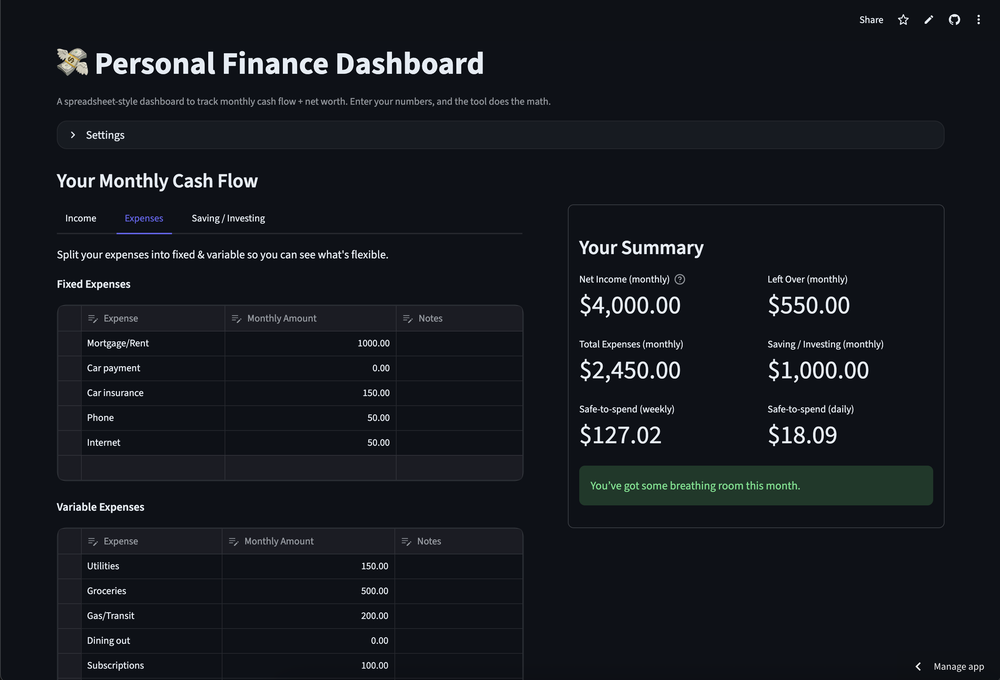

# 💸 Personal Finance Dashboard
This is a modern, spreadsheet-style personal finance dashboard built with Streamlit, modeled after the Excel spreadsheet I use to track my own finances.

It’s designed to help you clearly see where your money is going, how much flexibility you actually have each month, and what you’d realistically need if income ever stopped, without feeling overwhelming or judgmental.

The goal for this tool is clarity, calm, and confidence in knowing exactly where your finances stand.

## ✨ Features
### Monthly Cash Flow
Track your income, fixed expenses, variable expenses, and saving/investing in one place. The dashboard automatically calculates:
- Net income
- Total expenses
- What’s left over
- Safe-to-spend amounts (weekly and daily)

### Summary
A clear, at-a-glance summary of the numbers that matter most. This section is intentionally front-and-center so you can immediately see:
- What’s coming in
- What’s going out
- What you actually have to work with

### Emergency Minimum
Estimates the minimum amount you’d need each month if your income stopped. This includes:
- Fixed bills (housing, insurance, phone, etc.)
- Essentials like groceries, utilities, and transportation
- Required minimum debt payments

It also calculates what that minimum looks like over 3, 6, and 12 months to help you set realistic emergency fund goals.

### Net Worth Tracking
Track your assets and liabilities side-by-side to see the bigger picture.
- Automatic net worth calculation
- Optional detailed debt breakdown (balances, APRs, and minimum payments)

### Export & Snapshots
Download your data so it’s never locked inside the app:
- Full snapshot as JSON
- Monthly cash flow tables as CSV
- Net worth tables as CSV

Useful for backups, deeper analysis, or importing somewhere else.

## How Calculations Work
### Net Income
- Uses the income you enter
- Can optionally estimate taxes if you enter gross income

### Expenses
- Fixed and variable expenses are summed monthly

### Left Over
- Net income − expenses − saving/investing  
- This represents what you actually have available to spend or adjust

### Emergency Minimum
- Fixed expenses  
- Essential variable expenses (auto-detected by category name)  
- Minimum debt payments  

> The emergency minimum is intentionally conservative. It represents survival-level spending, not comfort, so you can plan with reality rather than optimism.