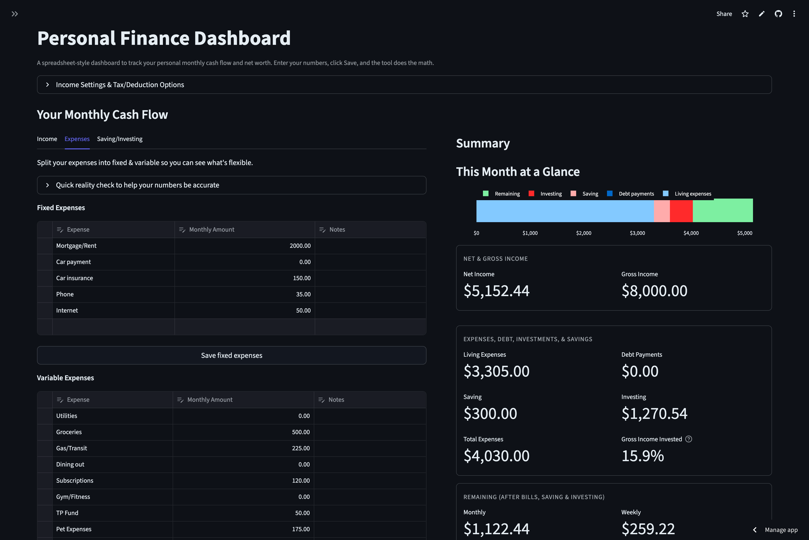
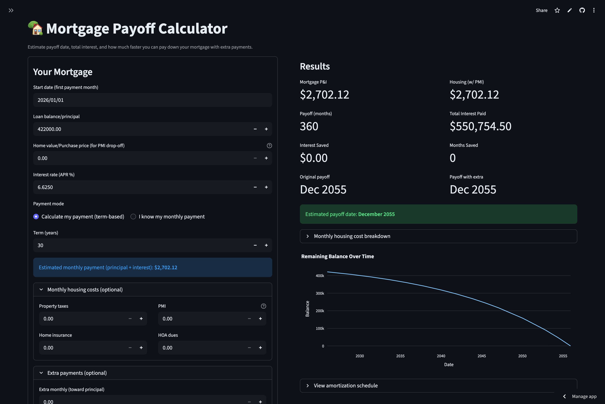

# 💸 The Financial Breakdown
The Financial Breakdown is a set of simple, spreadsheet-style personal finance tools built with Streamlit. It started as an Excel spreadsheet I made for myself when I realized I technically *had* money, but didn’t really know where it was going or what it all looked like together.

This app is for people who earn money, spend money, and feel like their finances live in a bunch of disconnected places:
- Some numbers in their head
- Some in their bank app
- Some they’d rather not look at too closely

The goal is to break everything down and put it all in one place, so you can see what’s actually happening, BEFORE stress, guessing, or avoidance takes over.

In other words: *Break down the numbers before they break YOU down.*

---

## What’s Inside

### Monthly Cash Flow
This is the heart of the app.

You itemize your income, fixed expenses, variable expenses, and saving/investing. From there, the dashboard calculates:
- How much you’re actually bringing in
- How much you’re spending
- How much is going to debt
- What’s left over at the end of the month
- What that leftover looks like weekly and daily

It turns “I think this is fine?” into real numbers you can actually work with.

---

### Summary
A simple, at-a-glance view of the stuff that matters most.

No digging, no scrolling, just:
- What’s coming in
- What’s going out
- What’s already committed
- What you actually have left

This is meant to ground you, not overwhelm you.

---

### Emergency Minimum
This section answers the uncomfortable but important question:
**“What would I actually need if income stopped?”**

It estimates a conservative monthly minimum based on:
- Fixed bills (housing, insurance, phone, etc.)
- Essential variable spending like groceries, utilities, and transportation
- Required minimum debt payments

It also shows what that number looks like over 3, 6, and 12 months, so emergency fund planning is based on reality, not wishful thinking.

---

### Net Worth Tracking
This is about context, not pressure.

You can list your assets and liabilities side by side to see the bigger picture:
- Automatic net worth calculation
- Optional detailed debt breakdown (balances, APRs, minimum payments)

Nothing here is meant to judge progress, it’s just about knowing where you stand.

---

### 🏡 Mortgage Payoff Calculator
A separate tool for breaking down one of the biggest (and most stressful) numbers most people have.

The Mortgage Payoff Calculator helps you see:
- Your full amortization schedule
- When your mortgage is actually paid off
- How much interest you’ll pay over time
- What happens if you make extra monthly or one-time payments
- How many months you can shave off
- How much interest you save by paying extra

You can also optionally include:
- Property taxes
- Home insurance
- PMI
- HOA dues

If you enter a home value or purchase price, the calculator can estimate when PMI drops off, and how that changes your monthly housing cost.

This tool isn’t about telling you to pay your mortgage faster, it’s about letting you *see* the tradeoffs clearly so you can decide what makes sense for you.

---

### Export & Snapshots
Nothing you enter is trapped inside the app.

You can export:
- A full snapshot as JSON
- Monthly cash flow tables as CSV
- Net worth tables as CSV
- Mortgage amortization schedules as CSV

Useful for backups, deeper analysis, or just keeping your own records.